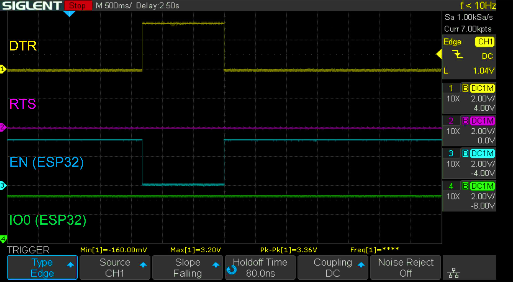

# ESP32 Development Boards - Getting started

A big variety of **ESP32** development boards (from Espressif and lots of other companies) have flooded the markets since the first ESP32 chip was released in 2016 by Espressif. Most boards contain the original **ESP32**, some an **ESP32-S2** and newer ones the most recent flavour **ESP32-S3**. For differences between those chips look [**here**](https://github.com/yellobyte/ESP32-DevBoards-Getting-Started/raw/main/ESP32_specs_and_manuals/Comparison_Espressif-ESP32-S2-C3-S3.pdf).

The ESP32 chip family is loaded with features, e.g. WiFi/Bluetooth, dual core (up to 240MHz clock frequency), integrated Flash memory, lots of GPIO pins (peripheral input/output), ADC/DAC, UART, I2S, SPI, low power states, JTAG debugging option, etc. Have a look at the many documents in folder [**ESP32_specs_and_manuals**](https://github.com/yellobyte/ESP32-DevBoards-Getting-Started/tree/main/ESP32_specs_and_manuals) for various ESP32 datasheets.

Almost all development boards feature a greater number of GPIO pins, a combination of WLAN antenna and/or IPX antenna connector, USB-Port, LDO voltage regulator and some LEDs (Power/RX/TX). Some boards have additional features, like TFT display, camera (e.g. OV2640), RGB-LED (e.g. WS2812B), battery connector, more Flash memory (up to 16MB) and/or PSRAM (up to 8MB), etc.

Probably the best way to get familiar with a certain board is writing a few tiny software programs (examples) for it. A good start would be to let the onboard LED blink or change color (RGB-LED), generate a few lines serial output, connect to the local WLAN, read the status of a connected push button, put the ESP32 into sleep mode, create a single file on an attached SD-Card or some other simple task. You get the idea.  

BTW: Arduino uses the name **sketch** (file extension *.ino) for a program. 

## :file_folder: Software Examples

Under [**boards**](https://github.com/yellobyte/ESP32-DevBoards-Getting-Started/tree/main/boards) you find a (growing) collection of programs for each board listed below. They will help you explore the features of those boards.

All examples were created and build with **VSCode/PlatformIO**. Each example has it's own project directory (one that contains a platformio.ini file). Make sure you have the latest **Arduino ESP32 development package** installed (V5.2.0 at the time of this writing).

For loading, editing and uploading an example just start VSCode/PlatformIO, go to "File"-->"Open Folder" and select the example's project directory.

Right now examples are provided for the following boards:

- [ESP32-DevKit-V1](https://github.com/yellobyte/ESP32-DevBoards-Getting-Started/tree/main/boards/ESP32-DevKit-V1_(Espressif)) (orig. Manufacturer: Espressif, DOIT)  
<p align="center"></p>  

- [ESP32-CAM, ESP32-CAM-USB and ESP32-CAM-MB](https://github.com/yellobyte/ESP32-DevBoards-Getting-Started/tree/main/boards/ESP32-CAM_(AI-THINKER)) (orig. Manufacturer: AI-THINKER)
<p align="center"></p>

- [ESP32-1.14-Display DevBoard](https://github.com/yellobyte/ESP32-DevBoards-Getting-Started/tree/main/boards/ESP32-1.14-Display-DevBoard_(TTGO)) (orig. Manufacturer: TTGO)
<p align="center"></p>

- [ESP32-S3-0.85-Display DevBoard](https://github.com/yellobyte/ESP32-DevBoards-Getting-Started/tree/main/boards/ESP32-S3-0.85-Display-DevBoard_(LILYGO)) (orig. Manufacturer: LILYGO)
<p align="center"></p>

- [ESP32-S3-1.9-Display DevBoard](https://github.com/yellobyte/ESP32-DevBoards-Getting-Started/tree/main/boards/ESP32-S3-1.9-Display-DevBoard_(LILYGO)) (orig. Manufacturer: LILYGO)
<p align="center"></p>

- [YD-ESP32-S3 DevBoard with big Flash and external PSRAM](https://github.com/yellobyte/ESP32-DevBoards-Getting-Started/tree/main/boards/YD-ESP32-S3_(VCC-GND.COM)) (orig. Manufacturer: VCC-GND.COM)  
<p align="center"></p>

## :hammer_and_wrench: Development platform VSCode/PlatformIO

Arduino IDE is easy for beginners, simple but somewhat limited in functionality. In contrast PlatformIO is a much more powerful and versatile alternative which makes every task a breeze after getting familiar with it. 

VSCode/PlatformIO provides some major advantages over the Arduino IDE:
  - very comfortable and mighty code Editor with lots of shortcuts & integrated Intellisense features that make writing code a breeze
  - usage of project file *platformio.ini* for controlling builds, adjusting serial monitor behaviour, enabling debugging, setting port parameters for software uploads (port, speed, RTS/CTS), etc.
  - easy search for/integration of additional libraries
  - integrated debugging functionality (additional external hardware required)
  - integrated source control (github)
  - etc.

### :heavy_exclamation_mark: Application notes  

Freshly released boards with special features (e.g. more Flash, additional PSRAM, exotic display) are sometimes only fully supported by the ESP32 development framework after being added to its official ESP32 board list! Normally this quickly happens but in rare cases this might take weeks/month or does not happen at all. If your particular board is not (yet) on the board list and you want to start programming it anyway then in platformio.ini select another, already known board from the list which preferably is similar in features to your new board and you should be good to go.  

In this case, be aware, you might not be able to fully utilize every board feature and build logs might report incorrect port numbers, memory sizes, etc. Provided example [Test-ESP32-S3-1.9inch_RAM-PSRAM](https://github.com/yellobyte/ESP32-DevBoards-Getting-Started/tree/main/boards/ESP32-S3-1.9-Display-DevBoard_(LILYGO)/examples/Test-ESP32-S3-1.9inch_RAM-PSRAM) demonstrates how to reveal the true memory sizes of an ESP32 development board. Have a look at this example's files _Build.log_ & _Serial_Output.log_ to see above mentioned discrepancies.

### :zap: Useful settings in platformio.ini

The project configuration file has sections (each denoted by a [header]) and one or multiple key/value pairs within the sections. Lines beginning with ";" are ignored and may be used to provide comments. The file platformio.ini is explained in more detail [here](https://docs.platformio.org/en/stable/projectconf/index.html). 

**Important:** Different examples might require different build options, so always have a look at the platformio.ini file for relevant infos.

Some very useful general settings (for more experienced programmers) deserve to be mentioned here. 
1) Forces builds to use older platform packages and/or frameworks instead of the newest one.
```
;platform = espressif32
platform = espressif32 @ 4.2.0
platform_packages = framework-arduinoespressif32 @ https://github.com/espressif/arduino-esp32/releases/download/2.0.4/esp32-2.0.4.zip
;platform_packages = framework-arduinoespressif32@https://github.com/espressif/arduino-esp32.git#2.0.3
```
2) Serial output lines carry time stamps, exceptions get decoded with function backtrace and serial output gets logged to a file:
```
monitor_filters = time, esp32_exception_decoder, log2file
```
3) The program is compiled with full symbolic debug information and no optimization.
```
build_type = debug
```
4) Enables usage of ESP32 JTAG debug adapter "[ESP32-Prog](https://github.com/yellobyte/ESP32-DevBoards-Getting-Started/raw/main/debugging/doc/ESP-Prog.jpg)" for debugging.
```
debug_tool = esp-prog
```
5) Sets the initial breakpoint to first line in function setup().
```
debug_init_break = tbreak setup
```
6) Generates various levels of debug output.
```
; 0 no debug output, 1 errors, 2 warnings, 3 infos, 4 debug info, 5 verbose 
build_flags = -DCORE_DEBUG_LEVEL=4
```
7) Disables any activity on COM signals RTS and/or DTR. Required by some ESP32 dev boards to enable serial output (e.g. ESP32-CAM-MB board). However, this setting prevents the IDE from selecting boot modes and performing automatic software uploads to the board. In this case you must start the upload while pressing the boot mode button (usually named BOOT, PRG or IO0) for a few seconds.
```
monitor_rts = 0
monitor_dtr = 0
```
8) Switch between various built-in tables. A big collection of predefined tables can be found [here](https://github.com/espressif/arduino-esp32/tree/master/tools/partitions).
```
;board_build.partitions = min_spiffs.csv
board_build.partitions = no_ota.csv
```
9) Your own "partitions_custom.csv" in the root of the project directory.
```
board_build.partitions = partitions_custom.csv
```
10) Collection of personal tasks, to be found under PlatformIO -> PROJECT TASKS -> Custom. Eventual paths are relative to the project folder.
```
extra_scripts = add_tasks.py
```

### :information_source: Resetting the board and uploading software via USB

The easiest way to reset an ESP32 dev board is to press the **reset button** (mostly labeled **RST** or **EN**). The easiest way to put the ESP32 into flash or upload mode is to press and release the reset button while holding down the button which selects the ESP32 boot mode (mostly labeled **BOOT**, **PRG** or **IO0**).

But have you ever wondered why your dev board sometimes is resetting when you start the Serial Monitor task and your development environment (PlatformIO or Arduino IDE) performs a successful software upload to the ESP32 and resets the board afterwards without prompting to press any button ? Here is why:

Almost every ESP32 dev board with an USB port hosts a little but nevertheless sophisticated circuitry which is located between the USB-to-UART bridge chip (usually CP2102, FT232 or CH340) and the ESP32. Such a chip has a lot of pins, the 4 most important ones are called **TX** (output, for data sent from PC to the ESP32), **RX** (input, for data sent from ESP32 to the PC), **DTR** (output, legacy "Data Terminal Ready") and **RTS** (output, legacy "Request To Send"). Back in the computer stone age the signals DTR & RTS (among others) were used to control the connection between Computers/Terminals and analog modems.

The whole magic is such that the little tool **esptool** (which is part of the development environment) can independently set those signals to active (0=low) or passive (1=high) which tells the ESP32 to reboot or go into upload mode. 

The above mentioned circuitry is shown below. DTR & RTS are connected to the USB bridge chip and EN & IO0 are connected to the ESP32.


That way an IDE can work with a dev board without prompting to press any physical buttons, means one can work remotely on a PC that is running the IDE and is connected to a dev board. Lying comfortably with a laptop on a couch at home while the dev board is far away (e.g. in an office) would be possible. In my case I additionally have a USB camera attached which enables me to see the onboard LEDs or displays. :-)  

For the following demonstrations a program is running on the board (or gets uploaded) which simply switches the onboard LED on & off and produces some serial output. After starting the Serial Monitor task in PlatformIO this is shown:

```
--- Terminal on COM4 | 115200 8-N-1
--- Available filters and text transformations: colorize, debug, default, direct, esp32_exception_decoder, hexlify, log2file, nocontrol, printable, send_on_enter, time
--- More details at https://bit.ly/pio-monitor-filters
--- Quit: Ctrl+C | Menu: Ctrl+T | Help: Ctrl+T followed by Ctrl+H
16:32:43.709 > LED off
16:32:44.887 > LED on
16:32:45.887 > LED off
16:32:46.880 > LED on
....
```
As one can see the serial monitor task just starts to display the serial output from the board and no reset happens.  

**Resetting the board:**

The dev board will perform a reset when you enter the key combinations CTRL-T followed by CTRL-D and again CTRL-T followed by CTRL-D as shown below:

```
...
16:32:43.709 > LED off
16:32:44.887 > LED on
--- DTR inactive ---
--- DTR active ---
16:34:21.426 > ets Jun  8 2016 00:22:57
16:34:21.429 >
16:34:21.429 > rst:0x1 (POWERON_RESET),boot:0x13 (SPI_FAST_FLASH_BOOT)
16:34:21.434 > configsip: 0, SPIWP:0xee
16:34:21.436 > clk_drv:0x00,q_drv:0x00,d_drv:0x00,cs0_drv:0x00,hd_drv:0x00,wp_drv:0x00
16:34:21.443 > mode:DIO, clock div:2
16:34:21.445 > load:0x3fff0030,len:1184
16:34:21.447 > load:0x40078000,len:13132
16:34:21.449 > load:0x40080400,len:3036
16:34:21.451 > entry 0x400805e4
16:34:21.588 > ESP32-DevKitC-V1 board LED test started. MODE = 0
16:34:21.594 > LED off
16:34:22.581 > LED on
16:34:23.581 > LED off
....
```
How come ? Let's look at the signals on the dev board while doing above key combinations.  

Without serial monitor task being started, DTR & RTS signals are usually both inactive (1=high). Starting the serial monitor will change the signals DTR & RTS to active (0=low). In both cases ESP32 pins EN & IO0 see a logical high(1) and the ESP32 continues to run normally and unaffected by the change.  

Entering CTRL-T followed by CTRL-D for the first time makes the signal DTR change to inactive (1=high). This makes the signal EN go low(0) and the ESP32 stops running. Only after entering CTRL-T followed by CTRL-D for the second time the signal DTR becomes active again (0=low) and the signal EN on the ESP32 rises to high(1). The ESP32 is not resetted anymore and re-starts the program as shown above.



In some rare cases the dev board resets after the serial monitor task has been started, which might be annoying. But why is it so ?  

Have a look at the signal snapshot below which was taken the moment the serial monitor task was started. As expected both signals DTR & RTS go from inactive (1=high) to active (0=low) but this time with a slight delay in between. This causes a short negative impulse on the EN line and resets the ESP32. Such small impulses happen only now and then though. It took me about 20 serial monitor starts to capture one. 

-reset.jpg)
  
**Uploading software to the board:**

When a Development Environment (PlatformIO, Arduino IDE) performs a software upload to the board the same signals are used to put the ESP32 into programming mode before the upload.  

An upload usually looks like this:

```
Configuring upload protocol...
AVAILABLE: cmsis-dap, esp-bridge, esp-prog, espota, esptool, iot-bus-jtag, jlink, minimodule, olimex-arm-usb-ocd, olimex-arm-usb-ocd-h, olimex-arm-usb-tiny-h, olimex-jtag-tiny, tumpa
CURRENT: upload_protocol = esptool
Looking for upload port...
Using manually specified: COM4
Uploading .pio\build\esp32dev\firmware.bin
esptool.py v4.2.1
Serial port COM4
Connecting............
Chip is ESP32-D0WDQ6 (revision 1)
Features: WiFi, BT, Dual Core, 240MHz, VRef calibration in efuse, Coding Scheme None
Crystal is 40MHz
MAC: 24:6f:28:b2:11:50
Uploading stub...
Running stub...
Stub running...
Changing baud rate to 921600
Changed.
Configuring flash size...
Flash will be erased from 0x00001000 to 0x00005fff...
Flash will be erased from 0x00008000 to 0x00008fff...
Flash will be erased from 0x0000e000 to 0x0000ffff...
Flash will be erased from 0x00010000 to 0x0004cfff...
Compressed 17440 bytes to 12127...
Writing at 0x00001000... (100 %)
Wrote 17440 bytes (12127 compressed) at 0x00001000 in 0.3 seconds (effective 438.4 kbit/s)...
Hash of data verified.
Compressed 3072 bytes to 128...
Writing at 0x00008000... (100 %)
Wrote 3072 bytes (128 compressed) at 0x00008000 in 0.0 seconds (effective 611.5 kbit/s)...
Hash of data verified.
Compressed 8192 bytes to 47...
Writing at 0x0000e000... (100 %)
Wrote 8192 bytes (47 compressed) at 0x0000e000 in 0.1 seconds (effective 865.8 kbit/s)...
Hash of data verified.
Compressed 247776 bytes to 136936...
Writing at 0x00010000... (11 %)
Writing at 0x0001c6f8... (22 %)
Writing at 0x00024ba5... (33 %)
Writing at 0x00029c94... (44 %)
Writing at 0x0002f14c... (55 %)
Writing at 0x00037886... (66 %)
Writing at 0x0003fb24... (77 %)
Writing at 0x00044fb9... (88 %)
Writing at 0x0004a87c... (100 %)
Wrote 247776 bytes (136936 compressed) at 0x00010000 in 2.1 seconds (effective 934.3 kbit/s)...
Hash of data verified.

Leaving...
Hard resetting via RTS pin...
============================================================== [SUCCESS] Took 8.73 seconds =======================================================
```

The sigal trace shows that in this case Esptool needs a second attempt to put the ESP32 into programming mode. The second time signal IO0 stays low(0) a bit longer. However, the upload then is ok and is trailed by a hard reset accomplished with RTS briefly going active (0=low) while DTR stays inactive (1=high).

.jpg)

Zooming in shows in more detail how the ESP32 is put into upload mode. Immediately after the EN pin goes high an ESP32 starts running and checks the status of the IO0 pin first. If high(1) it will run normally, if low(0) it will enter upload mode.


**Troubleshooting:**   
Some dev boards notoriously defy to be flashed and all attempts of Esptool to upload software permanently fail. It then looks like this:
```
Configuring upload protocol...
AVAILABLE: cmsis-dap, esp-bridge, esp-prog, espota, esptool, iot-bus-jtag, jlink, minimodule, olimex-arm-usb-ocd, olimex-arm-usb-ocd-h, olimex-arm-usb-tiny-h, olimex-jtag-tiny, tumpa
CURRENT: upload_protocol = esptool
Looking for upload port...
Using manually specified: COM4
Uploading .pio\build\esp32dev\firmware.bin
esptool.py v4.2.1
Serial port COM4
Connecting...............................................
```
Finally Esptool gives up and prints an error message. This happens sometimes with various dev boards but always with the original ESP32-T dev board equipped with an ESP32-Bit module (shown below). Which is very annoying for it is a slim board, can be equipped with different EP32 modules and therefore I have a preference for it and use it in many projects.

Looking at the signals EN & IO0 the idea came up to delay the reset signal a bit. I gave it a try and soldered a small capacitor of 100nF between EN & GND. This did the trick. Now the automatic software upload with Esptool works flawlessly on all modified ESP32-T boards. Maybe this solution might help with other renitent boards.


### :information_source: Debugging a program 

Under construction.
