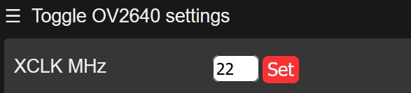

ESP32-CAM AI-Thinker camera boards come in different flavours. All boards I came across featured at minimum an ESP32-S module, an OV2640 camera socket, a PSRAM chip (4MB) and a high power LED.

**ESP32-CAM:** smallest size, no additional features, got to be programmed with a separate USB-TTL module [connected](doc/ESP32-CAM_Programming.JPG) to it.

**ESP32-CAM-MB:** comes with a (removable) sandwich board, which contains a USB-TTL bridge chip (CH340C), IO0 & RST buttons and a microUSB socket. The additional board is used for programming the camera board and printing it's serial output.

**ESP32-CAM-USB:** single board, slightly bigger than the ESP32-CAM board, containing a USB-TTL bridge chip (CH340C), FLASH & RST buttons and a microUSB socket.

**Important:**

If you don't get any serial output when using the **ESP32-CAM-MB** sandwich board then you need to add below lines to the [env:esp32cam] section in platformio.ini, this will disable any activity on COM signals RTS and/or DTR:
```
monitor_rts = 0
monitor_dtr = 0
```

Very few camera boards (maybe camera dependent?) have problems to deliver a proper video stream. In such case it almost always helped to vary the camera clock XCLK slightly, e.g from 20MHz (default) to 18MHz or 22Mhz. Just experiment with various frequencies and choose one that fits you best. This can be done on the Web interface: 
<p align="left"></p>  

or in the program in function setup():
```
  config.xclk_freq_hz = 18000000; // 18MHz
```
