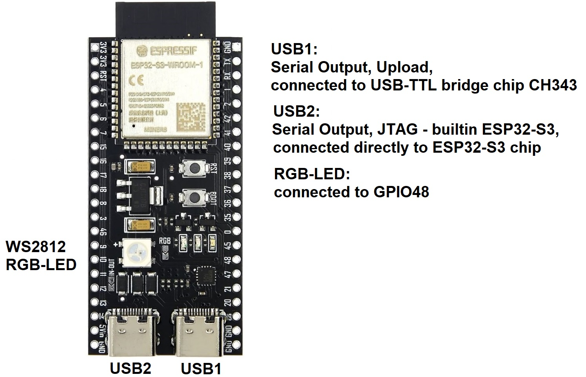
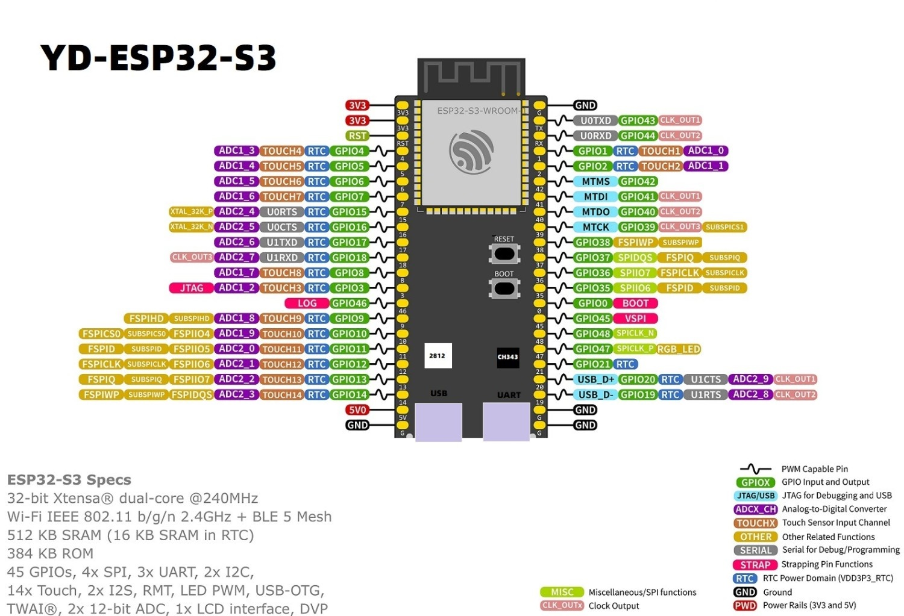

## YD-ESP32-S3 Development Board Overview:
The development board "YD-ESP32-S3-N8R2 is an ESP32-S3-DevKitC-1 clone and features two USB-C sockets, 8MB Flash, 2MB PSRAM, abundant GPIO pins, one WS2812B RGB-LED and WiFi/BT5LE.  

Other variants e.g. with 16MB Flash/8MB PSRAM (-N16R8), 8MB Flash/8MB PSRAM (-N8R8) and many [more](doc/YD-ESP32-S3_DevBoard_Variants.JPG) are available as well.



## Board Pin Layout:
 

## Important:
The USB2 socket is connected directly to the ESP32-S3 chip. Therefore when resetting the board a PC/Laptop connected to USB2 might temporarily lose connection (the associated COM port can disappear for a second or two). This might confuse some terminal programs.  

With both USB ports connected simultaneously you will see 2 COM ports and a usb device "USB JTAG/serial debug unit".  

The PlatformIO builder scripts (*.json) for modules containing ESP32-S3/C3 should already define the build flag ARDUINO_USB_MODE=1. It disables the USB-OTG mode. If not (or you want to override it) you can (re-)define it in your platformio.ini control file. Normally you don't have to worry about it.

Serial output generated with Serial.print() can be directed to USB1 or USB2. A single build flag in platformio.ini defines the USB port it goes to:
- **ARDUINO_USB_CDC_ON_BOOT=0**, serial output --> USB1
- **ARDUINO_USB_CDC_ON_BOOT=1**, serial output --> USB2

If you don't get any serial output right after flashing the dev board but instead
```
--- Terminal on COM7 | 115200 8-N-1
--- Available filters and text transformations: colorize, debug, default, direct, esp32_exception_decoder, hexlify, log2file, nocontrol, printable, send_on_enter, time
--- More details at https://bit.ly/pio-monitor-filters
--- Quit: Ctrl+C | Menu: Ctrl+T | Help: Ctrl+T followed by Ctrl+H
00:51:01.676 > ESP-ROM:esp32s3-20210327
00:51:01.676 > Build:Mar 27 2021
00:51:01.676 > rst:0x1 (POWERON),boot:0x0 (DOWNLOAD(USB/UART0))
00:51:01.676 > waiting for download
```  
then simply add "**monitor_rts = 0**" to platformio.ini and this will fix the problem.

In very rare cases I couldn't get any serial output at all on USB1/2 right after flashing. Resetting the board by pressing the RST button always fixed the problem.
